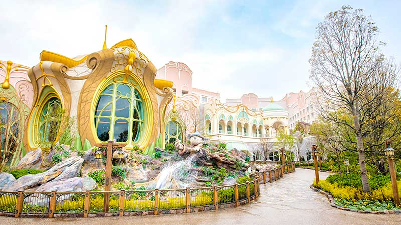

<!DOCTYPE html>
<html lang="zh-Hant">
<head>
  <meta charset="UTF-8">
  <meta name="viewport" content="width=device-width, initial-scale=1.0">
  <title>帶孩遊迪士尼攻略</title>
  
</head>
<body>
  <h1>帶孩遊迪士尼攻略</h1>
  
  
給迪士尼粉爸媽的懶人包，讓你玩回票價、孩子開心大人也輕鬆！

  <h2>行前準備</h2>
  <h3>決定日期篇</h3>
  
建議選擇 <strong>週二至週四</strong>，人潮較少。可參考人潮預測網站：<a href="https://yosocal.com/" target="_blank">yosocal.com</a>

  <h3>APP 篇</h3>
  <ul>
    <li>出發前先下載官方 APP 並綁定信用卡</li>
    <li>預約飯店與餐廳</li>
    <li class="tip">💡 使用台新 @GOGO + Richart Life App 驗證快速方便</li>
  </ul>

  <h2>住宿建議</h2>
  
  <ul>
    <li>選擇有 <strong>Happy Entry</strong> 的迪士尼飯店</li>
    <li>免費行李配送服務，方便換飯店</li>
    <li>飯店內設有便利商店與迪士尼商品店</li>
  </ul>

  <h2>餐廳預約</h2>
  
一個月前即可預約表演餐廳：

  <ul>
    <li>陸地：波里尼西亞草壇餐廳（米奇七彩晚宴）、鑽石馬蹄（綜藝秀）</li>
    <li>海洋：鱈魚岬（達菲與好友的非凡友誼）</li>
  </ul>

  <h2>必備小物</h2>
  <ul>
    <li>推車、陽傘、簽名簿與奇異筆</li>
    <li>保冰水壺、折疊保鮮盒、野餐墊</li>
  </ul>

  <h2>迪士尼樂園攻略</h2>
  
  
<strong>重點：</strong>美女與野獸、米奇魔法音樂世界、Reach for the stars

  
💡 建議入園前已經將票掃入APP，以利操作 DPA/ER/PP

  <ul>
    <li>08:00 抵達 HE 入口</li>
    <li>08:45 提早入園 → 美女與野獸 DPA</li>
    <li>09:00 抽米奇秀 ER + Club Mouse Beat ER</li>
    <li>使用完一項設施 DPA 後，立刻買下一個（如杯麵）</li>
  </ul>

  <h2>迪士尼海洋攻略</h2>
  
  
<strong>重點：</strong>夢幻泉鄉三設施、彼得潘、Nemo、玩具總動員

  <ul>
    <li>08:00 抵達 HE 入口</li>
    <li>08:45 入園後立刻買 Elsa DPA，衝夢幻泉鄉</li>
    <li>09:00 排樂佩 → 接著彼得潘 → Elsa</li>
    <li>中午後可搭船或電車移動，省腳力</li>
  </ul>
  
💡 夜間秀可依喜好決定是否購買 DPA，有很多不錯的觀賞角度

</body>
</html>
